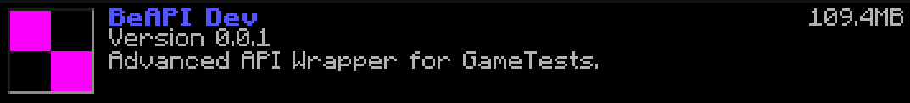

# BeAPI

GameTest FrameWork is a great and amazing new feature in Minecraft Bedrock Edition. This gives you the ability to script and do much more! BeAPI essentially is an api warpper for the "mojang-minecraft" module of the GameTest Framework. BeAPI adds more useful methods to this framework.

## Installation
* Requirements
  * [node.js](https://nodejs.org/)

To download and install, you can either git clone the repo or download the .zip file.
```git clone https://github.com/MCBE-Utilities/BeAPI.git```
Place the BeAPI folder inside your "development_behavior_packs" folder for Minecraft Bedrock.
Once you have done that, you will find "BeAPI Dev" as an available behavior pack for your world.


## Building
Once you have added any of your code or have changed any of BeAPI, you must build the project so Minecraft can reconize it.
To do so, must open the BeAPI project in [Visual Studio Code]() or open with CMD.
Once open, inside the terminal run the command below.
```npm run build```
Once ran, there will be a "scripts" folder that will be generated, and inside that folder will be your modified code.

## Compiling
BeAPI allows you to compile your code into a .mcpack, so other people can use your creations, or so you can use it on Realms.
To compile your project, run the command below.
```npm run compile```
Once the project is compiled, there will be a new folder in your BeAPI folder called "output".
Inside the "output" folder will be your compiled .mcpack.
Then you can share your pack and import it to Minecraft.
Once imported, you will be able to find the pack in your available behavior packs.
