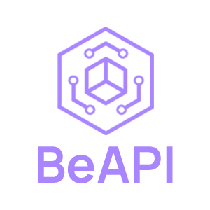

  

  
  
  

## About
BeAPI (an abbreviation for "Bedrock edition API") is a tool that aims
for a faster and more reliable development experience when working
with Minecraft Bedrock edition gametests. We achieve these goals by putting together some of the most brilliant minds in the Minecraft Bedrock developer community to scheme up alternative ways to utilize the gametest framework so it's easier for you!

## Support
Gametest currently only supports [Javascript](https://developer.mozilla.org/en-US/docs/Web/JavaScript); because of this we are only really left with two primary language support options; [Typescript](https://www.typescriptlang.org/) and [Javascript](https://developer.mozilla.org/en-US/docs/Web/JavaScript) project scaffolds.

## How It Works
BeAPI uses NPM's cli create app feature to provide you with a setup to scaffold your projects. This allows for a clean working environment separated from the core codebase. We also provide a cli for building and bundling your packs.

## Where Do I Start?
Check out our [docs](https://mcbe-utilities.github.io/BeAPI)!

## Issues / Feature Request
Please submit an issue following the proper templates
## Contributing
Pull requests are welcome. For major changes, please open an issue first to discuss what you would like to change.

Please make be sure to **TEST** all functionality before requesting

## License
[MIT](https://choosealicense.com/licenses/mit/)