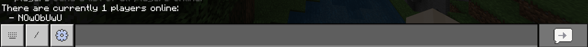

## The Scaffold
Depending on whether you chose the Typescript
or Javascript template; You might see something
a bit different. Its all the same concept though
just slightly differing syntaxes.

```js title="src/index.js"
import { client } from 'beapi-core'

client.commands.register(
  {
    name: 'ping',
    description: 'Ping gametest scripts.',
    aliases: ['p'],
  },
  (data) => {
    data.sender.sendMessage('§ePong!')
  },
)
```
Essentially what this is doing is importing client
from BeAPI, calling the [CommandManager](/docs/classes/commandmanager)
and saying "Hey, I want to make a new BeAPI command which responds with
'Pong!' when used".

<!-- :::note
Gametest currently does not support registering "slash" commands
BeAPI implements a chat command solution which uses a different prefix.
::: -->

When you go in-game and use the command:
```
-help
```
You should see something along the lines of this:


And running:
```
-ping
```
Will send:


## Players Command
So lets say we want to register a new command that
will send us the current amount of players online
and a list of all their names?

First we need to register a new command. So below
`ping` lets register a new command `players`.
```js title="src/index.js"
client.commands.register(
  {
    name: 'players',
    description: 'Send a list of all players online.',
    aliases: ['p']
  },
  (data) => {
    
  }
)
```

Next we will want to get all players currently online
and assign them to a variable. So inside the command callback.
We will add the following:
```js title="src/index.js"
client.commands.register(
  {
    name: 'players',
    description: 'Send a list of all players online.',
    aliases: ['p']
  },
  (data) => {
    // Map all player values into an array.
    const players = Array.from(client.players.getAll().values())
  }
)
```
What this does is accesses BeAPIs [PlayerManager](/docs/classes/playermanager)
through the client and asks to retrieve all player. We then grab only the values
from the map and put them in an array.

Then using some basic Javascript methods we can map the player names out of the
array and join them into a string.
```js title="src/index.js"
client.commands.register(
  {
    name: 'players',
    description: 'Send a list of all players online.',
    aliases: ['p']
  },
  (data) => {
    // Map all player values into an array.
    const players = Array.from(client.players.getAll().values())
    // Map out names into strings
    const list = players.map((player) => `  - ${player.getName()}`).join('\n')
    
  }
)
```

Finally we need to pipe all this data to the player. We can do so by accessing
the data parameter on the callback and accessing the `sender` property to send
a message to the player.
```js title="src/index.js"
client.commands.register(
  {
    name: 'players',
    description: 'Send a list of all players online.',
    aliases: ['p']
  },
  (data) => {
    // Map all player values into an array.
    const players = Array.from(client.players.getAll().values())
    // Map out names into strings
    const list = players.map((player) => `  - ${player.getName()}`).join('\n')
    // Send data to user
    data.sender.sendMessage(`There are currently ${players.length} players online:\n${list}`)
  }
)
```

Now make sure we save then run `npm run build` to build our scripts.

Now in-game when we type the command:
```
-players
```
we should see:


## Is That All?
No! BeAPI is a pretty powerful tool, what was shown above
is only a small amount of what BeAPI is capable of.

Our primary goal is to polyfill features gametest does
not yet provide to give you (the developer) a better experience.


